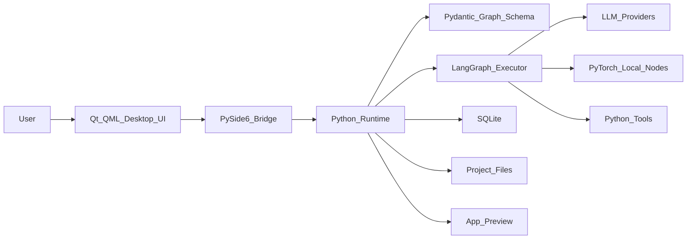

# Visual Builder

Visual Builder is a desktop-first visual programming environment for building AI workflows and AI-powered applications with drag-and-drop nodes.

Think of it as:

> PyTorch, but visual programming for AI applications.

The goal is to let users design AI systems visually, run them locally through Python, debug every step, and eventually package those workflows into real applications.

## What This Project Is

Visual Builder is not just a simple workflow demo. It is planned as a serious local-first AI builder where users can:

- Create AI workflows by dragging boxes onto a canvas
- Connect nodes with typed input and output ports
- Configure prompts, models, tools, conditions, memory, and outputs
- Run the graph through a Python execution engine
- Watch execution status, logs, tool calls, and streamed results
- Save projects locally and reopen them later
- Turn workflows into usable app templates over time

## Core Concept

The app has two main layers:

1. **Visual graph editor**
   - Built with Qt/QML
   - Handles the native desktop UI, canvas, nodes, edges, panels, and user interaction

2. **Python runtime**
   - Validates graph files with Pydantic
   - Compiles visual graphs into executable Python workflows
   - Runs AI workflows with LangGraph, Python tools, LLM APIs, local models, and future PyTorch nodes

```text
Qt/QML visual canvas
        |
        v
Graph JSON
        |
        v
Pydantic validation
        |
        v
Python execution graph
        |
        v
LangGraph / PyTorch / tools / LLM APIs
        |
        v
Run output, logs, generated app preview
```

## Planned Tech Stack

### Desktop UI

- Qt 6
- QML
- PySide6

### Python Runtime

- Python 3.12+
- Pydantic
- LangGraph
- PyTorch for future local model and tensor nodes
- asyncio
- QThread or worker processes for long-running jobs

### Local Storage

- SQLite for metadata, settings, and run history
- JSON workflow files for portable projects
- Local file storage for assets, prompts, generated files, and templates

### Future Cloud Stack

Cloud is not required for the MVP, but the project may later add:

- FastAPI
- PostgreSQL
- pgvector
- Redis
- Object storage
- Docker

## Architecture



## Planned Node Types

Initial nodes:

- Input
- Prompt
- LLM
- Tool
- Condition
- Output

Future nodes:

- Embedding
- Retriever
- Loop
- Agent
- Dataset loader
- Data transform
- Classifier
- PyTorch model
- Local vision model
- Speech-to-text
- Text-to-speech
- Image generation
- API endpoint
- Database query
- Human approval

## MVP Goals

The first milestone is to prove that users can visually create and run a useful AI workflow locally.

MVP scope:

- Native Qt/QML desktop shell
- Draggable node canvas
- Connectable ports and edges
- Node inspector panel
- Save and load local projects
- Pydantic graph validation
- Python runtime execution
- LangGraph integration
- Basic LLM workflow execution
- Run console with logs and streamed output
- Simple generated app preview

## Roadmap

### Phase 0: Prototype

- Build Qt/QML app shell
- Prototype draggable node boxes
- Draw edges between ports
- Send graph data from QML to Python
- Validate the graph with Pydantic
- Run a fake executor and stream status back to the UI

### Phase 1: MVP

- Add project save/load
- Add node inspector
- Add Input, Prompt, LLM, Tool, Condition, and Output nodes
- Integrate LangGraph
- Add run console
- Add provider settings
- Add one app preview template

### Phase 2: Usable Builder

- Add undo/redo
- Add node search palette
- Add stronger graph validation
- Add local run history
- Add reusable custom tools
- Add document ingestion and retrieval nodes
- Add local vector memory
- Add project templates

### Phase 3: Application Generation

- Add app templates
- Add configurable app input forms
- Add app preview mode
- Add generated app folder
- Add export to Python project
- Add packaging support for generated apps

### Phase 4: Advanced AI Programming

- Add PyTorch node support
- Add local model nodes
- Add multimodal nodes
- Add agent memory
- Add human approval nodes
- Add debugging breakpoints
- Add graph versioning
- Add subgraphs and reusable components
- Add plugin SDK

### Phase 5: Cloud and Collaboration

- Add user accounts
- Add cloud sync
- Add project sharing
- Add hosted workflow execution
- Add organization workspaces
- Add deployment targets

## Packaging Plan

Initial target platforms:

- Windows first
- macOS second
- Linux third

Packaging options under consideration:

- PyInstaller for the MVP
- Nuitka if more packaging control or performance is needed
- Briefcase if the project moves toward the BeeWare ecosystem

## Project Status

This project is currently in the planning/prototype stage.

The next development priority is the QML node canvas prototype, because the visual editor is the core technical risk and the heart of the product.

## Design Principles

- Keep Python as the serious runtime.
- Keep QML focused on interaction and presentation.
- Make graph files portable and versioned.
- Prefer local-first before cloud-first.
- Start with useful templates, not unlimited code generation.
- Make debugging and execution visibility core features.
- Build a small reliable MVP before expanding the node library.

## Repository Plan

The planned structure may look like this:

```text
visual_builder/
  app/
    qml/
    main.py
  visual_builder/
    graph/
    runtime/
    nodes/
    storage/
    bridge/
  tests/
  examples/
  docs/
  plan.md
  README.md
```

## License

License not selected yet.

