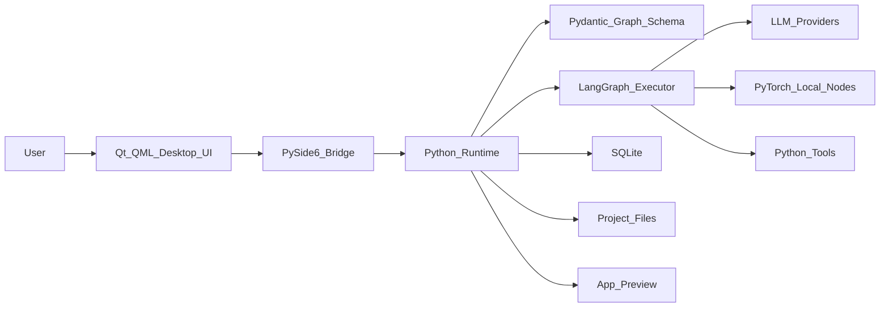

# Visual Builder Project Plan

## Product Vision

Build a desktop-first visual programming environment for creating AI systems and AI-powered applications with drag-and-drop boxes.

The simplest way to describe the product:

> PyTorch, but visual programming for AI applications.

Users should be able to create AI workflows by placing nodes on a canvas, connecting them together, configuring each node, running the graph, debugging execution, and eventually packaging the graph as a usable application.

The product should feel like a serious builder tool, not just a demo workflow editor.

## Core Idea

The application has two main layers:

1. **Visual graph layer**
   - Users drag boxes onto a canvas.
   - Users connect ports between boxes.
   - Each box represents an AI, data, logic, tool, or app component.
   - The canvas saves a structured graph.

2. **Python runtime layer**
   - The saved graph is validated with Python schemas.
   - The graph is compiled into executable Python logic.
   - The runtime executes the graph using LangGraph, Python tools, LLM APIs, local models, or PyTorch components.
   - Execution status streams back to the desktop UI.

Basic flow:

```text
Qt/QML visual canvas
        |
        v
Graph JSON
        |
        v
Pydantic validation
        |
        v
Python execution graph
        |
        v
LangGraph / PyTorch / tools / LLM APIs
        |
        v
Run output, logs, generated app preview
```

## Recommended Software Stack

### Desktop App

- **Qt 6**
- **QML**
- **PySide6**

Qt/QML is a good fit because the product is desktop-first and needs a polished native interface, local file access, offline-capable projects, and strong canvas-style UI control.

QML should handle presentation, animation, user interaction, panels, and canvas rendering. Python should own validation, persistence, runtime execution, model calls, and graph compilation.

### Python Runtime

- **Python 3.12+**
- **Pydantic** for graph schemas and validation
- **LangGraph** for AI workflow execution
- **PyTorch** for future local model and tensor-based nodes
- **asyncio** for streaming and async execution
- **QThread** or worker processes for long-running jobs that must not block the UI

### Local Storage

- **SQLite** for local project metadata, run history, and settings
- **JSON project files** for portable visual graph definitions
- **Local file storage** for assets, prompts, app templates, and generated files

For vector search and memory:

- Start with a local vector store such as **Chroma** or SQLite-based vector extensions.
- Use **pgvector** later only if cloud sync or server-hosted projects become important.

### Optional Server Later

Do not require a server for the MVP. Add one only when needed for accounts, sharing, teams, cloud sync, hosted deployment, or billing.

Future server stack:

- **FastAPI**
- **PostgreSQL**
- **pgvector**
- **Redis**
- **Object storage**
- **Docker**

## High-Level Architecture



## Main Application Modules

### 1. Visual Canvas

The visual canvas is the most important part of the product.

It should support:

- Dragging nodes
- Connecting output ports to input ports
- Selecting, moving, deleting, copying, and grouping nodes
- Zooming and panning
- Snapping and alignment helpers
- Edge routing
- Node search palette
- Keyboard shortcuts
- Undo and redo
- Canvas minimap later

This is the highest-risk UI component because QML does not provide a React Flow equivalent out of the box. Prototype this early.

### 2. Node System

Every node should have:

- Unique ID
- Type
- Position
- Input ports
- Output ports
- Configuration data
- Validation rules
- Runtime behavior
- UI display metadata

Initial node types:

- **Input**: accepts user text, files, parameters, or structured data
- **Prompt**: builds prompts from templates and variables
- **LLM**: calls OpenAI, Anthropic, Gemini, Ollama, or other models
- **Embedding**: generates embeddings
- **Retriever**: searches documents or memory
- **Tool**: calls a Python function, API, shell-safe operation, or plugin
- **Condition**: branches based on values
- **Loop**: repeats over lists or retry logic
- **Agent**: higher-level reasoning node
- **Output**: final response, file, app view, or structured result

Future node types:

- Dataset loader
- Data transform
- Classifier
- PyTorch model
- Local vision model
- Speech-to-text
- Text-to-speech
- Image generation
- Browser automation
- API endpoint
- UI component
- Database query
- Human approval

### 3. Inspector Panel

When a user clicks a node, the inspector should show editable properties.

Examples:

- Model provider
- Model name
- Temperature
- Prompt template
- Input mapping
- Output schema
- Tool parameters
- Retry policy
- Timeout
- Memory settings

The inspector should be schema-driven as much as possible. Python node definitions should describe which fields the UI needs to render.

### 4. Python Graph Schema

Use Pydantic models to define the graph format.

The schema should include:

- Project metadata
- Node definitions
- Edge definitions
- Port definitions
- Node configuration
- App template configuration
- Runtime settings
- Version number for migrations

The graph schema is a core product asset. It should be stable, explicit, and versioned from the beginning.

### 5. Runtime Engine

The runtime engine converts a visual graph into executable behavior.

Responsibilities:

- Validate graph structure
- Detect missing inputs
- Detect invalid connections
- Detect cycles where not allowed
- Compile graph to LangGraph or custom Python execution steps
- Execute nodes in order
- Stream node status to the UI
- Capture logs, errors, and outputs
- Save run history

Execution states:

- Pending
- Running
- Waiting for input
- Succeeded
- Failed
- Skipped
- Cancelled

### 6. Run Console

The run console should make execution understandable.

It should show:

- Current running node
- Node-by-node status
- Token streaming output
- Tool calls
- Tool results
- Errors
- Timings
- Final result

This is important because visual AI programs will be hard to trust without clear debugging.

### 7. Project System

Projects should be local-first.

Each project should contain:

- Project metadata
- Workflow graph
- App template settings
- Local assets
- Run history
- Environment/provider settings

Suggested storage:

```text
my_project/
  project.json
  workflows/
    main.workflow.json
  assets/
  generated/
  runs/
```

SQLite can store indexes, recent projects, run summaries, and settings. Project files should remain portable.

### 8. App Builder Layer

The long-term goal is not only to run AI workflows, but to build applications from them.

Start with templates instead of arbitrary code generation.

Initial app templates:

- Chat assistant
- Document Q&A app
- Research assistant
- Data extraction app
- Agent with tools
- Form-to-workflow app
- Local automation tool

Each template maps workflow inputs and outputs into a usable app interface.

Later releases can add:

- Custom UI screens
- Drag-and-drop UI builder
- Export to Python app
- Export to web app
- Desktop app packaging
- Hosted deployment

## MVP Definition

The MVP should prove that a user can visually build and run a useful AI workflow locally.

MVP features:

- Native desktop window with Qt/QML
- Draggable node canvas
- Connectable ports and edges
- Basic node inspector
- Save and load project files
- Pydantic graph validation
- Python runtime execution
- LangGraph integration
- LLM node with at least one provider
- Prompt node
- Input node
- Output node
- Run console with logs and streaming output
- Simple app preview for one workflow type

MVP node set:

- Input
- Prompt
- LLM
- Tool
- Condition
- Output

MVP success criteria:

- A user can create a workflow visually.
- A user can save and reopen the workflow.
- A user can run the workflow.
- The UI shows which nodes are running.
- Errors are visible and understandable.
- The final output appears in the app.

## Release Roadmap

### Phase 0: Prototype

Goal: prove the canvas and Python bridge.

Tasks:

- Create Qt/QML app shell
- Build draggable node boxes
- Draw edges between ports
- Send graph data from QML to Python
- Validate graph with Pydantic
- Run a fake executor and stream status back to UI

Release target:

- Internal prototype only

### Phase 1: MVP

Goal: build and run simple AI workflows.

Tasks:

- Add project save/load
- Add inspector panel
- Add Input, Prompt, LLM, Tool, Condition, Output nodes
- Integrate LangGraph
- Add run console
- Add provider settings
- Add one app preview template

Release target:

- Private alpha

### Phase 2: Usable Builder

Goal: make the app useful for real workflows.

Tasks:

- Add undo/redo
- Add node search palette
- Add better validation
- Add local run history
- Add reusable custom tools
- Add document ingestion and retrieval nodes
- Add local vector memory
- Add better error handling
- Add project templates

Release target:

- Public beta

### Phase 3: Application Generation

Goal: let users turn workflows into usable apps.

Tasks:

- Add app templates
- Add configurable app input forms
- Add app preview mode
- Add generated app folder
- Add export to Python project
- Add packaging support for generated apps
- Add template marketplace later

Release target:

- First public release

### Phase 4: Advanced AI Programming

Goal: become a serious visual AI programming environment.

Tasks:

- Add PyTorch node support
- Add local model nodes
- Add multimodal nodes
- Add agent memory
- Add human approval nodes
- Add debugging breakpoints
- Add graph versioning
- Add subgraphs/components
- Add plugin SDK

Release target:

- Pro/advanced release

### Phase 5: Cloud and Collaboration

Goal: support teams, sharing, and hosted apps.

Tasks:

- Add user accounts
- Add cloud sync
- Add project sharing
- Add hosted workflow execution
- Add billing
- Add organization workspaces
- Add deployment targets

Release target:

- SaaS or team edition

## Packaging and Release Plan

Desktop targets:

- Windows first
- macOS second
- Linux third

Packaging options:

- **PyInstaller**: easiest to start with
- **Nuitka**: better optimization, more packaging control
- **Briefcase**: useful if following the BeeWare ecosystem

Recommended approach:

1. Start with PyInstaller during MVP.
2. Test packaging very early.
3. Move to Nuitka only if PyInstaller causes performance or distribution issues.
4. Keep project files and user data outside the installed app directory.

Release channels:

- Internal dev builds
- Private alpha installers
- Public beta installers
- Stable release

Important release features:

- Crash logs
- App versioning
- Project file migrations
- Settings migrations
- Auto-update strategy
- Signed installers eventually

## Development Priorities

Build in this order:

1. QML app shell
2. Visual node canvas prototype
3. Python bridge
4. Graph schema
5. Save/load
6. Runtime executor
7. LangGraph integration
8. Run console
9. App preview templates
10. Packaging

Do not start with advanced code generation. The first win is a stable visual graph editor that can run real AI workflows.

## Key Technical Risks

### QML Node Canvas Complexity

This is the biggest risk. The app needs a high-quality node editor, and Qt/QML does not provide the same ready-made ecosystem as React Flow.

Mitigation:

- Prototype canvas first.
- Keep graph model separate from visual rendering.
- Build simple node interactions before adding polish.

### Runtime and UI Thread Blocking

AI execution can be slow and unpredictable.

Mitigation:

- Never block the UI thread.
- Use async execution, workers, or separate processes.
- Stream status updates to QML.

### Graph Schema Drift

The visual graph, saved files, and runtime must agree.

Mitigation:

- Use Pydantic schemas.
- Version graph files from day one.
- Add migrations when schema changes.

### Overbuilding Too Early

The full vision is large.

Mitigation:

- Start with a small set of nodes.
- Use app templates before full arbitrary app generation.
- Make local-first work before adding cloud features.

## Future Ideas

- Visual debugger with breakpoints
- Time-travel run history
- Node marketplace
- Plugin SDK for custom Python nodes
- Local model manager
- Ollama integration
- Hugging Face integration
- Dataset and training nodes
- PyTorch model graph nodes
- RAG builder templates
- Agent team builder
- Export workflow as Python package
- Export workflow as REST API
- Export workflow as desktop app
- Export workflow as web app
- Voice assistant builder
- Image/video generation workflow builder
- App template marketplace
- Team collaboration
- Cloud execution

## Product Positioning

Possible positioning:

- Visual AI programming environment
- Desktop AI app builder
- Node-based AI workflow IDE
- PyTorch-style visual builder for AI apps
- Local-first AI application builder

Strongest positioning for now:

> A local-first desktop visual programming environment for building AI workflows and applications.

## Guiding Principles

- Keep Python as the serious runtime.
- Keep QML focused on interaction and presentation.
- Make graph files portable and versioned.
- Prefer local-first before cloud-first.
- Start with useful templates, not unlimited code generation.
- Make debugging and visibility a core feature.
- Treat the node canvas as the heart of the product.
- Build a small reliable MVP before expanding node types.
